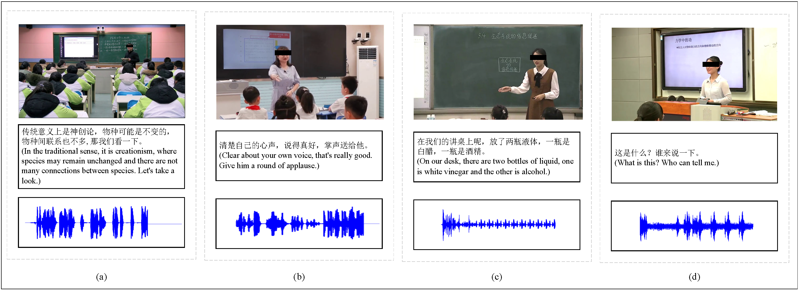

# **TER**

The first multimodal dataset that considers teacher-student emotion interactions (TER), which is audio and video data collected from teachers' real classrooms. 

TER is labeled with a total of four emotion labels: happiness, satisfaction, neutral, and question. To ensure the richness of teachers' emotions, the TER dataset spans multiple educational stages (primary, middle school, high school and university) and multiple subjects (such as Chinese, mathematics, English, physics, chemistry, etc.), with a total of 102 lessons and 2,170 video segments. 

Some examples of TER. (a) Happiness, (b) Satisfaction, (c) Neutral, (d) Question.