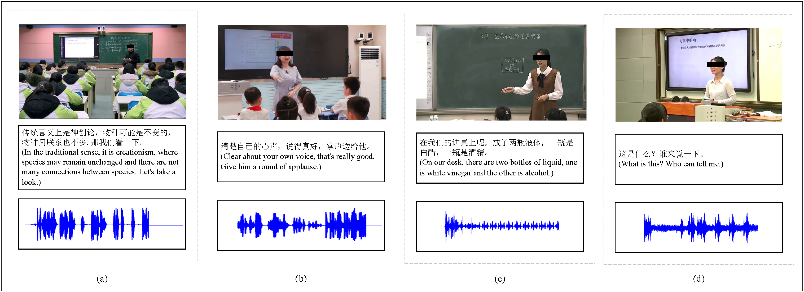

# **1.TER**

The first multimodal dataset that considers teacher-student emotion interactions (TER), which is audio and video data collected from teachers' real classrooms. 

TER is labeled with a total of four emotion labels: happiness, satisfaction, neutral, and question. To ensure the richness of teachers' emotions, the TER dataset spans multiple educational stages (primary, middle school, high school and university) and multiple subjects (such as Chinese, mathematics, English, physics, chemistry, etc.), with a total of 102 lessons and 2,170 video segments. 

Some examples of TER. (a) Happiness, (b) Satisfaction, (c) Neutral, (d) Question.

# **2. Usage License**
Neither the Chongqing University of Posts and Telecommunications nor any of the researchers involved can guarantee the correctness of the data, its suitability for any particular purpose, or the validity of results based on the use of the data set. The data set may be used for any research purposes under the following conditions:
- The user may not state or imply any endorsement from the Chongqing University of Posts and Telecommunications, Research Center for Artificial Intelligence and Smart Education (RCAISE).
- The user may redistribute the data set, including transformations, so long as it is distributed under these same license conditions.
- The user may not use this information for any commercial or revenue-bearing purposes without first obtaining permission from a faculty member of the RCAISE at the Chongqing University of Posts and Telecommunications.

If you have any further questions or comments, please email xiongyu@cqupt.edu.cn

# **3. Further Information About our research team**
Our research team is affiliated with the Research Center for Artificial Intelligence and Smart Education at the Chongqing University of Posts and Telecommunications. Our research projects have explored a variety of fields including:
- Intelligent educational application
- Teacher classroom evaluation
- multimodal learning
- Recommended teaching resources

If you have exciting ideas for experimental work to conduct on our teacher emotion recognition dataset, send us an email at xiongyu@cqupt.edu.cn, we are always interested in working with external collaborators.
